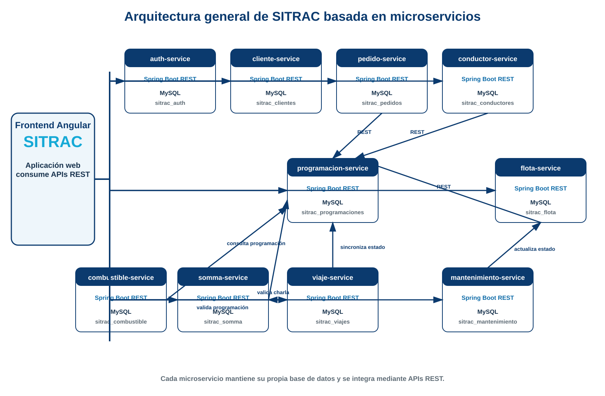
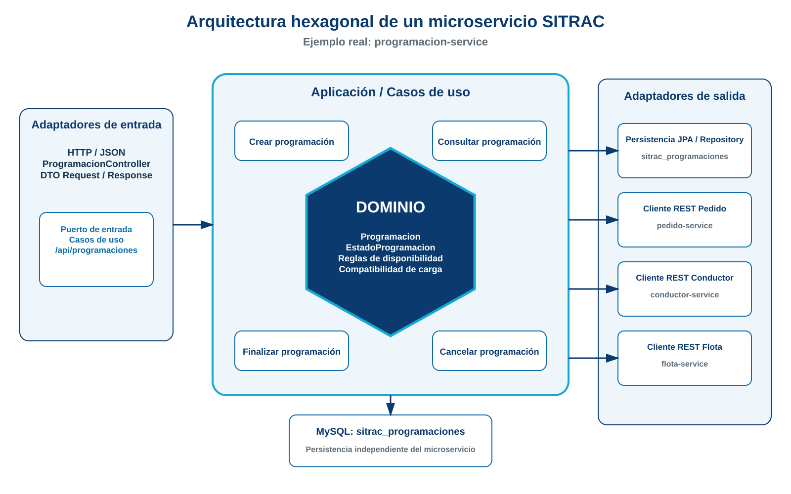
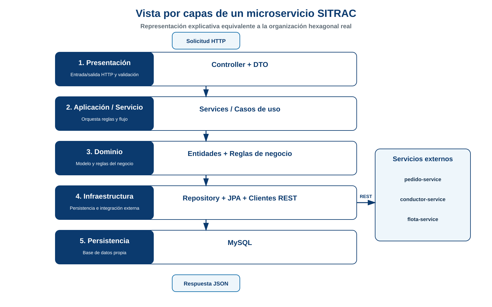
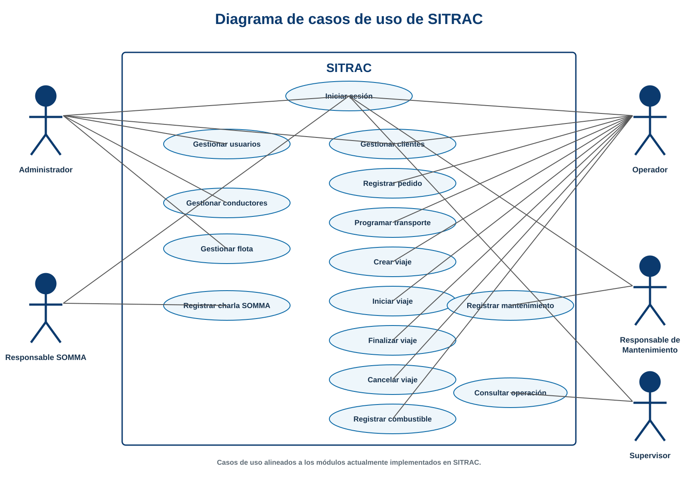
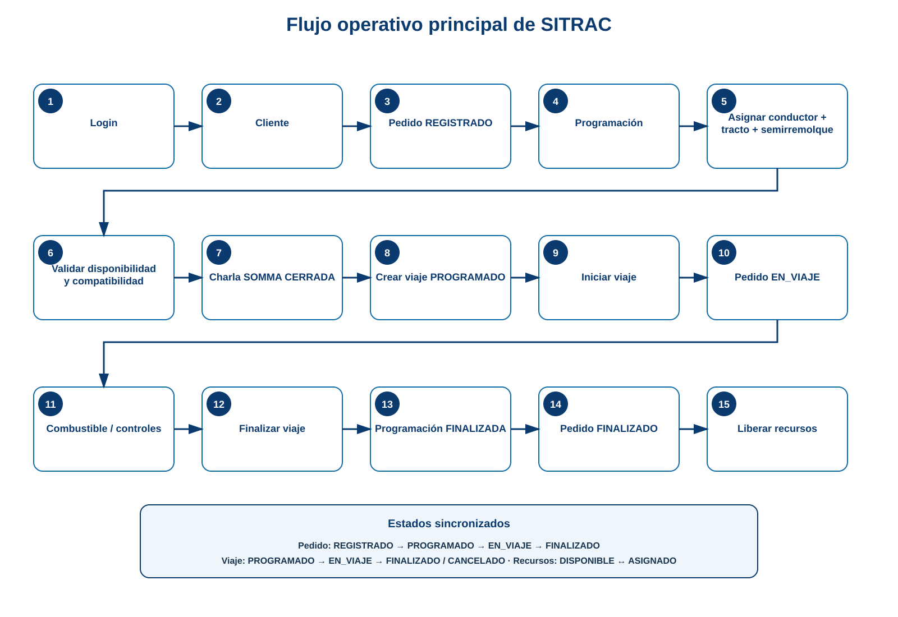

# Diagramas de arquitectura y análisis — SITRAC

Estos diagramas están alineados con la implementación actual de SITRAC en la rama `feature/microservicios-restantes`.

## Arquitectura general de microservicios

Muestra el frontend Angular, los 10 microservicios Spring Boot, la base MySQL independiente de cada servicio y las principales integraciones REST.

## Arquitectura hexagonal

Representa la organización real utilizada dentro de los microservicios. Se usa `programacion-service` como ejemplo porque integra dominio, casos de uso, adaptadores REST, persistencia JPA y clientes REST hacia otros servicios.

## Vista por capas

Esta figura es una **vista explicativa equivalente** para presentar el proyecto por capas. No reemplaza la arquitectura hexagonal implementada; permite relacionar presentación, aplicación, dominio, infraestructura y persistencia.

## Casos de uso

Actores representados: Administrador, Operador, Responsable SOMMA, Responsable de Mantenimiento y Supervisor. Los casos de uso corresponden a los módulos actualmente implementados.

## Flujo operativo principal

Resume el flujo integrado de SITRAC desde el inicio de sesión y registro del pedido hasta la finalización del viaje y liberación de recursos.

> Los SVG pueden insertarse directamente en Word o convertirse a PNG manteniendo alta calidad para el informe final.
